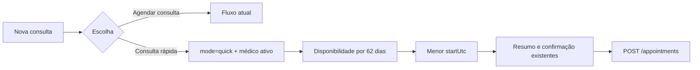

# Consulta Rápida Design

**Spec**: `.specs/features/quick-appointment/spec.md`
**Status**: Approved

---

## Architecture Overview

O recurso será um modo do formulário existente, não uma segunda página nem um contrato de API novo. A Agenda adiciona o parâmetro `mode=quick`; `NewAppointmentPage` amplia a consulta de disponibilidade para 62 dias, ordena todos os slots por `startUtc` e alimenta a seleção já usada pelo resumo e pelo POST.

## Code Reuse Analysis

### Existing Components to Leverage

| Component | Location | How to Use |
| --- | --- | --- |
| Agenda context | `src/features/appointments/AgendaPage.tsx` | Reusar médico e data ativos ao construir as duas rotas. |
| Appointment selection reducer | `src/features/appointments/newAppointmentState.ts` | Trocar médico já limpa data e slot. |
| Availability query | `src/features/appointments/NewAppointmentPage.tsx` | Alterar somente as datas em modo rápido. |
| Appointment summary | `src/features/appointments/AppointmentSummary.tsx` | Exibir paciente, médico, tipo, data e slot automaticamente resolvidos. |
| API conflict handling | `src/features/appointments/NewAppointmentPage.tsx` | Reusar erro `409`, invalidação e refetch já implementados. |

### Integration Points

| System | Integration Method |
| --- | --- |
| `GET /doctors/{id}/availability` | Um request de 62 dias, limite aceito pela API. |
| `POST /appointments` | Payload atual, sem campo ou enum novo. |
| Navegação local | Query params `mode=quick`, `date`, `doctorId` e `origin`. |

## Components

### Agenda action menu

- **Purpose**: Oferecer os dois caminhos sob `Nova consulta` e comunicar o médico contextual.
- **Location**: `src/features/appointments/AgendaPage.tsx`
- **Interfaces**: estado local aberto/fechado; `bookSlot(null)` para o fluxo atual; `bookQuickAppointment()` para o modo rápido.
- **Dependencies**: médico ativo, data ativa e navegação.
- **Reuses**: estilos e ícones do cabeçalho da Agenda.

### Quick appointment mode

- **Purpose**: Resolver e manter o primeiro slot disponível sem calendário ou grade manual.
- **Location**: `src/features/appointments/NewAppointmentPage.tsx`
- **Interfaces**: parâmetro `mode=quick`; disponibilidade calculada com `from` e `to`; seleção automática de `date` e `slot`.
- **Dependencies**: clínica, médico, `DoctorAvailability`, reducer e mutation existentes.
- **Reuses**: `PatientPicker`, `DoctorPicker`, chips de tipo, `AppointmentSummary`, feedback e recuperação de conflito.

## Data Models

Nenhum modelo persistente novo. O modo usa `DoctorAvailability`, `AvailabilitySlot` e o payload atual de `Appointment`.

## Error Handling Strategy

| Error Scenario | Handling | User Impact |
| --- | --- | --- |
| Médico ausente | Opção rápida desabilitada com motivo legível | Usuário escolhe ou cadastra um médico antes. |
| Disponibilidade carregando | Feedback específico no painel de horário | Confirmação permanece desabilitada. |
| Sem slot em 62 dias | Mensagem exata e nenhum fallback | Nenhuma consulta é criada fora da grade. |
| Falha de disponibilidade | `ErrorBlock` com retry | Usuário recupera sem perder paciente, médico ou tipo. |
| Conflito no POST | Mensagem do backend + refetch existente | Slot é recalculado sem sair do modo rápido. |

## Risks & Concerns

| Concern | Location (file:line) | Impact | Mitigation |
| --- | --- | --- | --- |
| Estado de seleção e hidratação estão concentrados em uma página grande | `src/features/appointments/NewAppointmentPage.tsx:71` | Um efeito rápido pode sobrescrever escolhas após troca de médico | Usar o reducer existente, depender do resultado identificado pelo médico e testar resposta fora de ordem. |
| Menu absoluto pode perder foco ou permanecer aberto | `src/features/appointments/AgendaPage.tsx:330` | Falha de teclado e leitor de tela | Manter `aria-expanded`, fechar em Escape/outside click e devolver foco ao gatilho. |
| Disponibilidade e criação não são uma única operação transacional | `src/features/appointments/NewAppointmentPage.tsx:231` | Outro usuário pode ocupar o slot antes do POST | Preservar a proteção `409`, atualizar a disponibilidade e explicar a recuperação. |

## Tech Decisions

| Decision | Choice | Rationale |
| --- | --- | --- |
| Contrato | Reusar availability + create | O backend já valida grade, bloqueio e conflitos; não há dado novo. |
| Identificação do modo | Query param `mode=quick` | Sobrevive à criação de paciente e permite link/contexto explícito. |
| Ordenação | Comparar `Date.parse(startUtc)` em todos os slots | Não depende da ordem de dias do servidor. |
| Fuso | Derivar `from` pelo `timeZoneId` da clínica | Evita buscar a data errada quando navegador e clínica divergem. |
